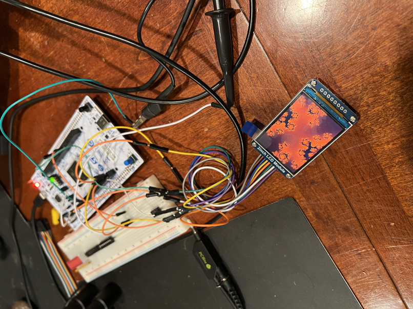

# STMc

STM32L5 fractal renderer.

## Components
- [STM Dev Board](https://www.digipart.com/part/NUCLEO-L552ZE-Q?msclkid=4b240ee1a4311ececccf6705e8bea0b9&utm_source=bing&utm_medium=cpc&utm_campaign=Tier_Popular&utm_term=NUCLEO-L552ZE-Q&utm_content=Tier_Popular_1)
- [LCD](https://www.amazon.com/dp/B082GFTZQD?ref=ppx_yo2ov_dt_b_fed_asin_title&th=1)
- [Gyroscope](https://www.amazon.com/dp/B00LP25V1A?ref=ppx_yo2ov_dt_b_fed_asin_title&th=1)
- [Push Buttons](https://www.amazon.com/dp/B0C8HPN318?ref=ppx_yo2ov_dt_b_fed_asin_title)

## Pictures

